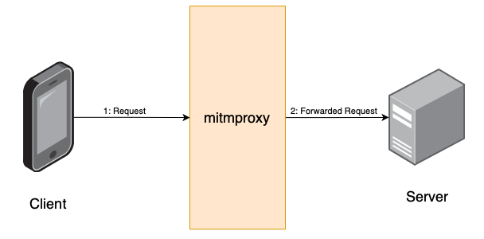

# Week 2: mitmproxy + ICMP
## [Slides](https://docs.google.com/presentation/d/1vUyNbqYavZbgM2SPJbEWxwJ60Z-ywxdZp5qm539f-7Q/edit?usp=sharing)

## Proxy servers

### Overview
In computer networking, a proxy server is a server application that acts as an intermediary between a client requesting a resource and the server providing that resource. Proxies improve privacy for the client because the request is routed through the proxy and the server sees the request come from the proxy.

### Decrypting SSL/TLS traffic
Because the HTTP/HTTPS traffic passes through the proxy, the proxy acts as a "man-in-the-middle" (MITM) and can see all the incoming/outgoing packets. By default, the proxy can't read the packet data but by installing a certificate for the proxy in your system, the SSL/TLS keys used for encrypting the packet can be saved and used for decrypting the packets later on by a sniffer.

### mitmproxy ([installation](https://docs.mitmproxy.org/stable/overview-installation/), [documentation](https://docs.mitmproxy.org/stable/))

mitmproxy is a free and open-source HTTP/HTTPS proxy. It can be installed on your system which can then be configured to forward all web traffic through the proxy. Read more about it in the linked documentation.

Working of a proxy web server

#### Installation
The steps below detail how you can install mitmproxy on your machine.

1. Follow the instructions [here](https://docs.mitmproxy.org/stable/overview-installation/) to install mitmproxy for your Windows, Linux, or MacOS machine.
2. Visit [mitm.it](https://mitm.it) on your browser to see the proxy status. You should see an error that says traffic isn't passing through mitmproxy.
3. Start the proxy on your machine by just typing `mitmproxy --listen-port 9000` on your command-line where `9000` could be any port number.
4. Configure your system to use the proxy for only HTTP and HTTPS requests. Set the server to `127.0.0.1` and port to `9000` or whatever port you specified in step 3. Follow instructions for your respective operating systems.
   - [Windows](https://oxylabs.io/resources/integrations/windows)
   - [Ubuntu](https://oxylabs.io/resources/integrations/ubuntu)
   - [MacOS](https://oxylabs.io/resources/integrations/mac)
5. At this point, your browser will start throwing security errors when you visit any other website. The error will tell you that someone is trying to listen to your traffic. To fix this, you need to install the mitmproxy certificates on your system and configure your system to trust them.
6. Go back to your browser where you previously opened [mitm.it](https://mitm.it) and hit refresh to see the updated site and follow instructions to install the certificate for your operating system.
7. You should now be able to browse the web normally but your traffic will be forwarded through the proxy and the terminal running the proxy will show requests going through it.

#### Decrypting SSL traffic
Once you've configured mitmproxy and its certificates, you can begin decrypting SSL traffic using Wireshark. The following steps explain how to do this.
1. Close the mitmproxy you started earlier by pressing `q` and then `y` in the terminal.
2. Restart the proxy using the following command `SSLKEYLOGFILE="$PWD/sslkeylogfile.txt" mitmproxy --listen-port 9000` where the port could be any number. This variant of the start command tells mitmproxy to write the SSL keys used to the file named `sslkeylogfile.txt` in the current directory.
3. Open Wireshark and navigate to `Preferences > Protocols > TLS > (Pre)-Master-Secret log filename > Browse` and select this file from the dialog window.
4. You should now be able to see decrypted traffic inside the Wireshark window. Filter for `http || http2 || http3` traffic. 

## ICMP
Internet Control Message Protocol (ICMP) is a network layer protocol that's generally used for diagnosing network issues. Two widely-used tools that use ICMP are `ping` and `traceroute`.

### Ping
#### Purpose
The `ping` command tests whether a target host is online and estimates the round-trip times (RTTs), i.e., the time it takes to send and receive data from that host.

#### Syntax
 - `ping ip_address`
 - `ping domain`

### Traceroute
The `traceroute` command calculates the round-trip times (RTTs) to each individual hop (i.e., routers) along the route to a target host.

#### Syntax
 - `traceroute ip_address`
 - `traceroute domain`
